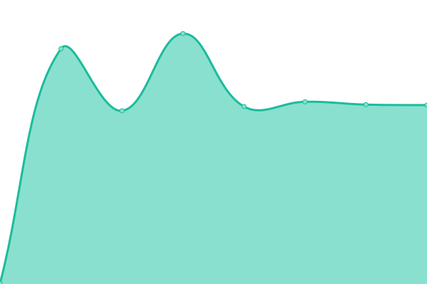
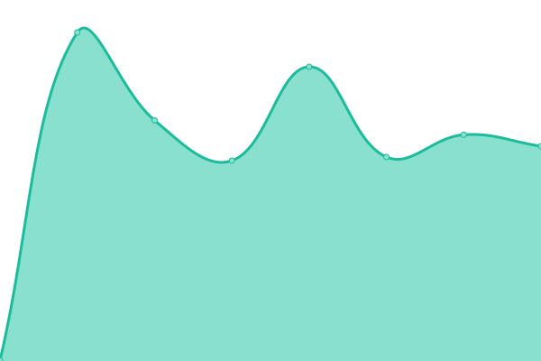
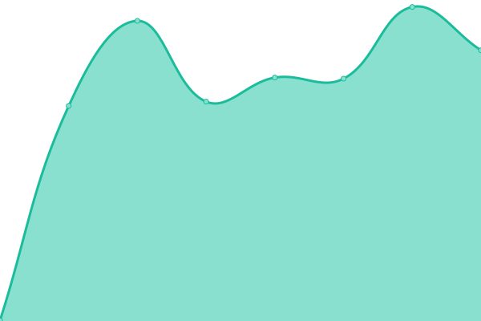

# [📈 Live Status](https://aceblockID.github.io/monitoring): <!--live status--> **🟩 All systems operational**

This repository contains the open-source uptime monitor and status page for [aceblockID](https://www.netis.si), powered by [Upptime](https://github.com/upptime/upptime).

With [Upptime](https://upptime.js.org), you can get your own unlimited and free uptime monitor and status page, powered entirely by a GitHub repository. We use [Issues](https://github.com/aceblockID/monitoring/issues) as incident reports, [Actions](https://github.com/aceblockID/monitoring/actions) as uptime monitors, and [Pages](https://aceblockID.github.io/monitoring) for the status page.

<!--start: status pages-->
<!-- This summary is generated by Upptime (https://github.com/upptime/upptime) -->
<!-- Do not edit this manually, your changes will be overwritten -->
<!-- prettier-ignore -->
| URL | Status | History | Response Time | Uptime |
| --- | ------ | ------- | ------------- | ------ |
|  AceBlock Homepage | 🟩 Up | [ace-block-homepage.yml](https://github.com/aceblockID/monitoring/commits/HEAD/history/ace-block-homepage.yml) | 

 2552ms
     
 | 

<a href="https://aceblockID.github.io/monitoring/history/ace-block-homepage">100.00%</a>
    

|  AceBlock SSI - RPC endpoint | 🟩 Up | [ace-block-ssi-rpc-endpoint.yml](https://github.com/aceblockID/monitoring/commits/HEAD/history/ace-block-ssi-rpc-endpoint.yml) | 

 461ms
     
 | 

<a href="https://aceblockID.github.io/monitoring/history/ace-block-ssi-rpc-endpoint">100.00%</a>
    

|  AceBlock SSI - IPFS endpoint | 🟩 Up | [ace-block-ssi-ipfs-endpoint.yml](https://github.com/aceblockID/monitoring/commits/HEAD/history/ace-block-ssi-ipfs-endpoint.yml) | 

 127ms
     
 | 

<a href="https://aceblockID.github.io/monitoring/history/ace-block-ssi-ipfs-endpoint">100.00%</a>
    

|  AceBlock Documentation | 🟩 Up | [ace-block-documentation.yml](https://github.com/aceblockID/monitoring/commits/HEAD/history/ace-block-documentation.yml) | 

 130ms
     
 | 

<a href="https://aceblockID.github.io/monitoring/history/ace-block-documentation">100.00%</a>
    

|  Aceblock SSI registration | 🟩 Up | [aceblock-ssi-registration.yml](https://github.com/aceblockID/monitoring/commits/HEAD/history/aceblock-ssi-registration.yml) | 

 1564ms
     
 | 

<a href="https://aceblockID.github.io/monitoring/history/aceblock-ssi-registration">100.00%</a>
    

|  Load balancer Gen-I | 🟩 Up | [load-balancer-gen-i.yml](https://github.com/aceblockID/monitoring/commits/HEAD/history/load-balancer-gen-i.yml) | 

 132ms
     
 | 

<a href="https://aceblockID.github.io/monitoring/history/load-balancer-gen-i">100.00%</a>
    

|  Load balancer SSI | 🟩 Up | [load-balancer-ssi.yml](https://github.com/aceblockID/monitoring/commits/HEAD/history/load-balancer-ssi.yml) | 

 125ms
     
 | 

<a href="https://aceblockID.github.io/monitoring/history/load-balancer-ssi">100.00%</a>
    

|  Load balancer T4 | 🟩 Up | [load-balancer-t4.yml](https://github.com/aceblockID/monitoring/commits/HEAD/history/load-balancer-t4.yml) | 

 126ms
     
 | 

<a href="https://aceblockID.github.io/monitoring/history/load-balancer-t4">100.00%</a>
    

|  AceBlock Mockup | 🟩 Up | [ace-block-mockup.yml](https://github.com/aceblockID/monitoring/commits/HEAD/history/ace-block-mockup.yml) | 

 154ms
     
 | 

<a href="https://aceblockID.github.io/monitoring/history/ace-block-mockup">100.00%</a>
    

|  AceBlock D-HUB | 🟩 Up | [ace-block-d-hub.yml](https://github.com/aceblockID/monitoring/commits/HEAD/history/ace-block-d-hub.yml) | 

 600ms
     
 | 

<a href="https://aceblockID.github.io/monitoring/history/ace-block-d-hub">100.00%</a>
    

|  AceBlock Meet | 🟩 Up | [ace-block-meet.yml](https://github.com/aceblockID/monitoring/commits/HEAD/history/ace-block-meet.yml) | 

 999ms
     
 | 

<a href="https://aceblockID.github.io/monitoring/history/ace-block-meet">100.00%</a>
    

|  AceBlock Redmine | 🟩 Up | [ace-block-redmine.yml](https://github.com/aceblockID/monitoring/commits/HEAD/history/ace-block-redmine.yml) | 

 509ms
     
 | 

<a href="https://aceblockID.github.io/monitoring/history/ace-block-redmine">100.00%</a>
    

|  AceBlock Space Client | 🟩 Up | [ace-block-space-client.yml](https://github.com/aceblockID/monitoring/commits/HEAD/history/ace-block-space-client.yml) | 

 305ms
     
 | 

<a href="https://aceblockID.github.io/monitoring/history/ace-block-space-client">100.00%</a>
    

|  MNID Issuer | 🟩 Up | [mnid-issuer.yml](https://github.com/aceblockID/monitoring/commits/HEAD/history/mnid-issuer.yml) | 

 403ms
     
 | 

<a href="https://aceblockID.github.io/monitoring/history/mnid-issuer">100.00%</a>
    

|  MNID Wallet | 🟩 Up | [mnid-wallet.yml](https://github.com/aceblockID/monitoring/commits/HEAD/history/mnid-wallet.yml) | 

 422ms
     
 | 

<a href="https://aceblockID.github.io/monitoring/history/mnid-wallet">100.00%</a>
    

|  MNID Homepage | 🟩 Up | [mnid-homepage.yml](https://github.com/aceblockID/monitoring/commits/HEAD/history/mnid-homepage.yml) | 

 451ms
     
 | 

<a href="https://aceblockID.github.io/monitoring/history/mnid-homepage">100.00%</a>
    

|  MNID NFT | 🟩 Up | [mnid-nft.yml](https://github.com/aceblockID/monitoring/commits/HEAD/history/mnid-nft.yml) | 

 392ms
     
 | 

<a href="https://aceblockID.github.io/monitoring/history/mnid-nft">100.00%</a>
    

|  MNID Portfolio | 🟩 Up | [mnid-portfolio.yml](https://github.com/aceblockID/monitoring/commits/HEAD/history/mnid-portfolio.yml) | 

 411ms
     
 | 

<a href="https://aceblockID.github.io/monitoring/history/mnid-portfolio">100.00%</a>
    

|  MNID Test DPP | 🟩 Up | [mnid-test-dpp.yml](https://github.com/aceblockID/monitoring/commits/HEAD/history/mnid-test-dpp.yml) | 

 492ms
     
 | 

<a href="https://aceblockID.github.io/monitoring/history/mnid-test-dpp">100.00%</a>
    

|  MNID MDL Verifier | 🟩 Up | [mnid-mdl-verifier.yml](https://github.com/aceblockID/monitoring/commits/HEAD/history/mnid-mdl-verifier.yml) | 

 396ms
     
 | 

<a href="https://aceblockID.github.io/monitoring/history/mnid-mdl-verifier">100.00%</a>
    

|  MNID MDL App | 🟩 Up | [mnid-mdl-app.yml](https://github.com/aceblockID/monitoring/commits/HEAD/history/mnid-mdl-app.yml) | 

 464ms
     
 | 

<a href="https://aceblockID.github.io/monitoring/history/mnid-mdl-app">100.00%</a>
    

|  Bluemark Homepage | 🟩 Up | [bluemark-homepage.yml](https://github.com/aceblockID/monitoring/commits/HEAD/history/bluemark-homepage.yml) | 

 1458ms
     
 | 

<a href="https://aceblockID.github.io/monitoring/history/bluemark-homepage">100.00%</a>
    

<!--end: status pages-->

[**Visit our status website →**](https://aceblockID.github.io/monitoring)

## 📄 License

- Powered by: [Upptime](https://github.com/upptime/upptime)
- Code: [MIT](./LICENSE) © [aceblockID](https://www.netis.si)
- Data in the `./history` directory: [Open Database License](https://opendatacommons.org/licenses/odbl/1-0/)
